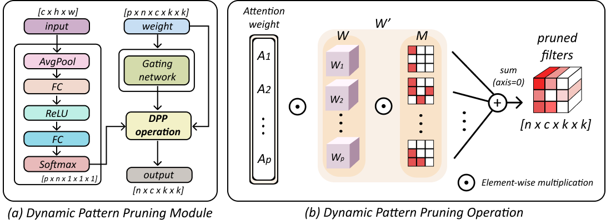

# CIKM'22 - Accelerating CNN via Dynamic Pattern-based Pruning Network
## Abstract



Recently, dynamic pruning methods have been actively researched,
as they have shown very effective and remarkable performance in
reducing computation complexity of deep neural networks. Nevertheless, 
most dynamic pruning methods fail to achieve actual acceleration 
due to the extra overheads caused by indexing and weight-
copying to implement the dynamic sparse patterns for every input
sample. To address this issue, we propose Dynamic Pattern-based
Pruning Network (DPPNet), which preserves the advantages of both
static and dynamic networks. First, our method statically prunes
the weight kernel into various sparse patterns. Then, the dynamic
convolution kernel is generated via aggregating input-dependent
attention weights and static kernels. Unlike previous dynamic pruning methods, 
our novel method dynamically fuses static kernel
patterns, enhancing the kernel’s representational power without
additional overhead. Moreover, our dynamic sparse pattern enables
an efficient process using BLAS libraries, accomplishing actual acceleration. 
We demonstrate the effectiveness of the proposed DPPNet on CIFAR and ImageNet, 
outperforming the state-of-the-art methods achieving better accuracy with lower computational cost.
For example, on ImageNet classification, ResNet34 utilizing DPP
module achieves state-of-the-art performance with 65.6% FLOPs
reduction and the inference speed increased by 35.9% without loss
in accuracy.

## Training Script
```
# 1. pruned models
python train.py -gpu=0,1,2,3 --amp --epoch=90 -bs=256 -am=dwpresnet34 --alpha=8e-6 --lr=0.1 \
--dataset=imagenet --scheduler=cosine --pretrained -md=8e-6_dwpresnet34

# 2. fine-tuning
python finetuning.py -gpu=0,1,2,3 --amp --epoch=40 -bs=256 -am=dynresnet34_fine --lr=0.01 \
--dataset=imagenet --scheduler=cosine --path=./saved_models/8e-6_dwpresnet34/best_model.pth \
-md=dwpresnet34_40epoch_finetuning_8e-6
```

## Environments Settings

- #### CUDA version >= 11.1
- #### Pytorch version >= 1.8
- #### Ubuntu 18.04
- #### I trained the model using 4 Gpus (Rtx3090).

